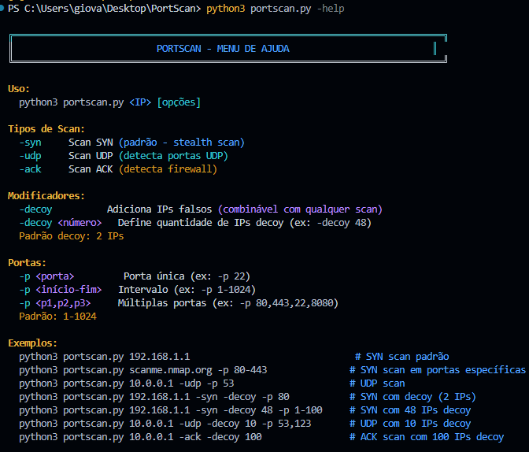
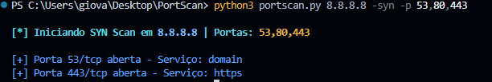
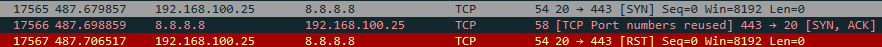
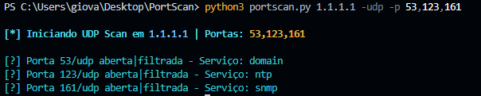
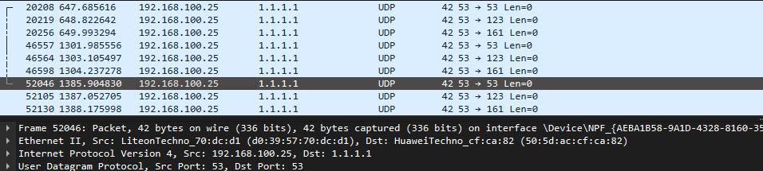
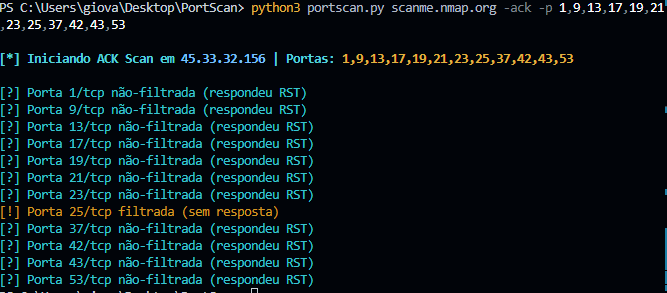
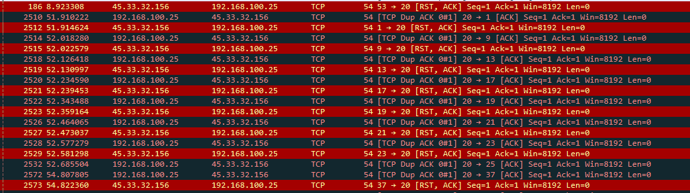
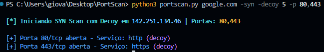
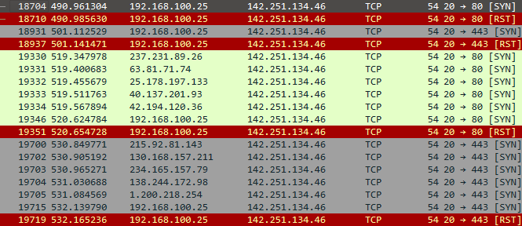

# 🔍 PortScan - Scanner de Portas em Python

Scanner de portas desenvolvido com Scapy, suportando múltiplos tipos de scan (SYN, UDP, ACK, Decoy).

---

## 📋 Requisitos

- **Python 3.x**
- **Privilégios de Administrador/Root** (necessário para envio de pacotes raw)
- **Dependências de sistema:**
  - **Windows:** [Npcap](https://npcap.com/#download) (marque "WinPcap API-compatible Mode")
  - **Linux:** `sudo apt install tcpdump libpcap-dev`

---

## ⚙️ Instalação

### 1. Clone o repositório
```bash
git clone https://github.com/GiKassime/PortScan.git
cd PortScan
```

### 2. Crie um ambiente virtual (recomendado)
```bash
python3 -m venv .venv
source .venv/bin/activate  # Linux/Mac
# ou
.venv\Scripts\activate     # Windows
```

### 3. Instale as dependências
```bash
pip install -r requirements.txt
```

---

## 🚀 Uso

### Menu de Ajuda
```bash
python3 portscan.py -help
```



---

## 📊 Tipos de Scan

### 1️⃣ SYN Scan (Padrão)
Técnica stealth que não completa o three-way handshake TCP.

**Comando:**
```bash
sudo python3 portscan.py <IP> -p 1-1000
```

**Resultado do Scan:**



**Captura no Wireshark:**



---

### 2️⃣ UDP Scan
Identifica portas UDP abertas (mais lento que TCP).

**Comando:**
```bash
sudo python3 portscan.py <IP> -udp -p 1-1000
```

**Resultado do Scan:**



**Captura no Wireshark:**



---

### 3️⃣ ACK Scan
Detecta regras de firewall e portas filtradas.

**Comando:**
```bash
sudo python3 portscan.py <IP> -ack -p 1-1000
```

**Resultado do Scan:**



**Captura no Wireshark:**



---

### 4️⃣ Decoy Scan
Envia pacotes com IPs falsos para dificultar rastreamento.

**Comando:**
```bash
sudo python3 portscan.py <IP> -decoy -p 1-1000
```

**Resultado do Scan:**



**Captura no Wireshark:**



---

## 📝 Exemplos para Apresentação

### 🎯 Testes Locais 
```bash
# Scan SYN em localhost - porta única
python3 portscan.py 127.0.0.1 -syn -p 80

# Scan SYN em localhost - múltiplas portas específicas
python3 portscan.py 127.0.0.1 -syn -p 22,80,443,3306

# Scan SYN em localhost - range de portas
python3 portscan.py 127.0.0.1 -syn -p 1-100
```

### 🌐 Testes em Sites Públicos
```bash
# SYN Scan no servidor de testes do Nmap (scanme.nmap.org)
python3 portscan.py scanme.nmap.org -syn -p 22,80,443

# UDP Scan em portas DNS
python3 portscan.py 8.8.8.8 -udp -p 53

# ACK Scan para detectar firewall
python3 portscan.py scanme.nmap.org -ack -p 1-1024
```

### 🎭 Testes com Decoy (IPs Falsos)
```bash
# Decoy com 3 IPs falsos - porta específica
python3 portscan.py scanme.nmap.org -syn -decoy 3 -p 80

# Decoy em range de portas
python3 portscan.py 127.0.0.1 -syn -decoy 5 -p 1-100
```

---


